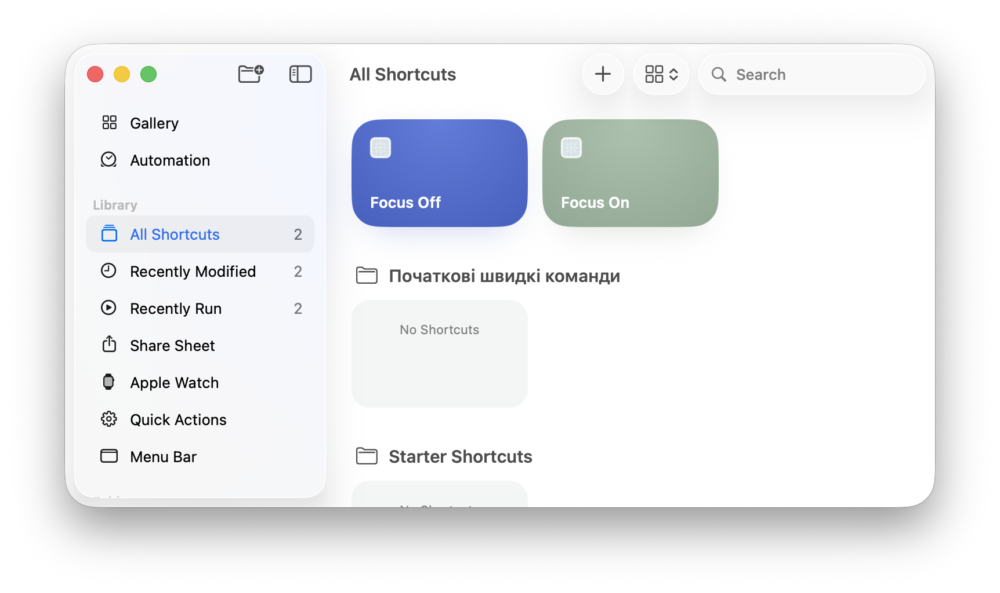
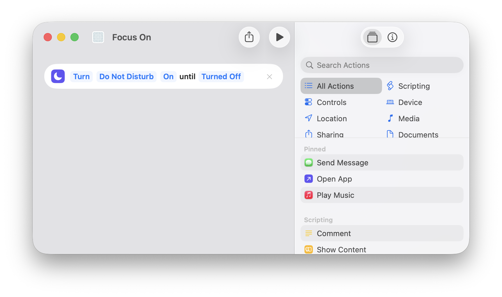
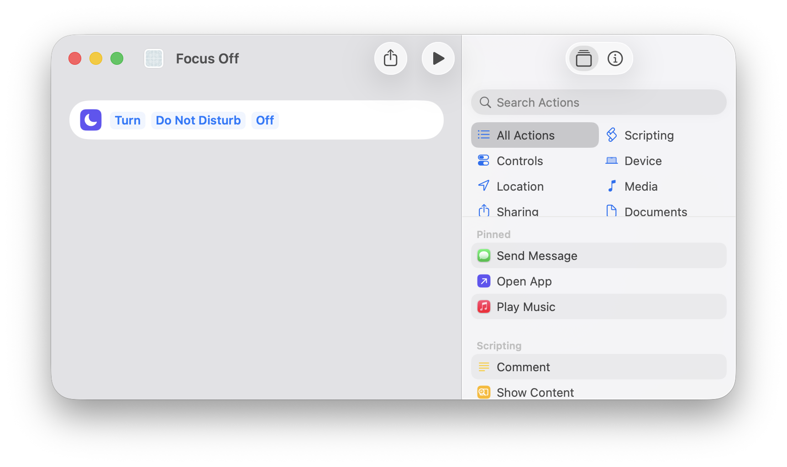
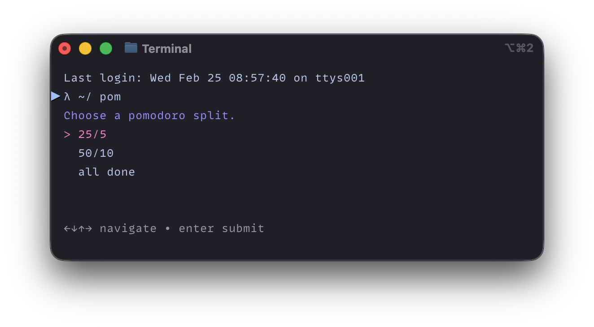
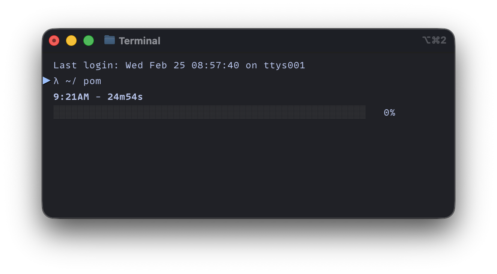
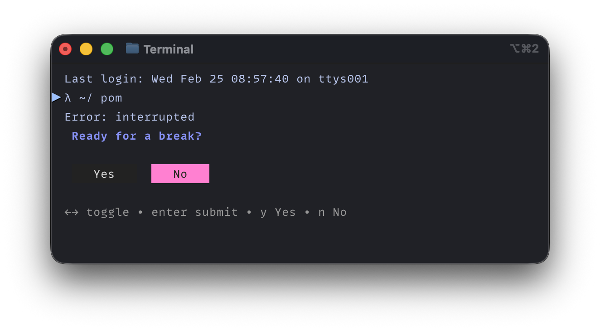

# pom

Pomodoro timer w/ Focus mode integration.

## Dependencies

```bash
brew install gum timer terminal-notifier
```

## Setup

Create two shortcuts in Shortcuts.app:

### 1. Create new shortcut
Open Shortcuts.app, click `+` in toolbar.



### 2. Focus On
- Search "Set Focus" action
- Configure: Turn Focus **On**
- Name it `Focus On`



### 3. Focus Off
- Same steps, but set Focus **Off**
- Name it `Focus Off`



## Usage

```bash
./pom.zsh
# or
POMO_SPLIT="25/5" ./pom.zsh  # skip menu
```

Splits: `25/5`, `50/10`, `all done` (exit)

### Demo






